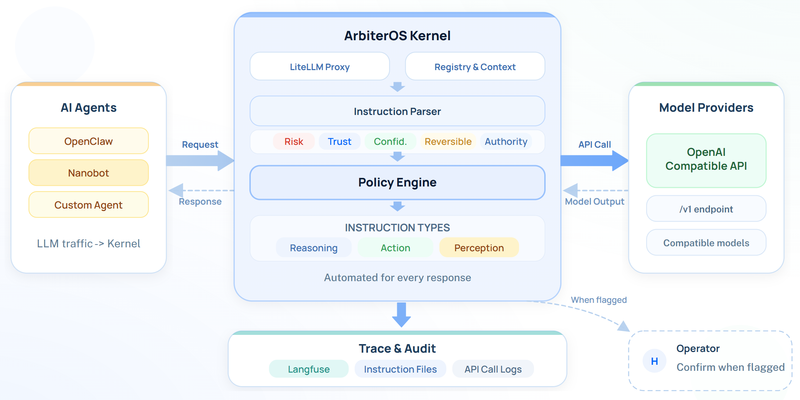

**Language:** English | [简体中文](./README.zh-CN.md)

<div align="center">

# 🛡️ ArbiterOS

### ArbiterOS: Governance Kernel for AI Agents

#### ArbiterOS sits beneath or beside your agent runtime to enforce policy, emit authoritative traces, and intercept unsafe actions before side effects occur.

[](https://github.com/cure-lab/ArbiterOS)
[](https://www.python.org/)
[](./LICENSE)
[](https://github.com/cure-lab/ArbiterOS)

[](https://arbiteros.ai/)
[](https://arbiteros.ai/demo/selected-cases/index.html?demoLang=en)
[](https://github.com/cure-lab/ArbiterOS)
[](https://arxiv.org/abs/2604.18652)

</div>

ArbiterOS is not another agent framework. It is a runtime governance layer for agent systems that route model calls through an OpenAI-compatible endpoint.

It focuses on three things first:

- **Authoritative trace** for what the agent planned, called, and returned.
- **Policy enforcement** over parsed instructions, tool calls, and taint-propagated dataflow.
- **Unsafe action interception** before sensitive side effects happen.

## ArbiterOS in Agent Systems



## Why ArbiterOS

- Drop-in governance boundary for agent runtimes that can customize LLM base URL and API key.
- Taint-aware policy checks over instruction flow and tool execution.
- Full local deployment support across Linux, macOS, and Windows.
- Auditable runtime logs and optional Langfuse-based visualization.
- Minimal host changes: point the agent runtime to ArbiterOS, then enforce policy before execution.

## Supported Integration Pattern

ArbiterOS Kernel currently works best with agent runtimes that can override the model endpoint per request or per profile.

- Supported in current repository: `OpenClaw`, `Nanobot`, `Hermes Agent`, and additional parser mappings documented in the Kernel codebase.
- Compatible serving pattern: OpenAI-compatible / LiteLLM-based routing.
- Default local endpoint after startup: `http://127.0.0.1:4000/v1`

## See Value Quickly

The fastest path is:

1. Install and start `ArbiterOS-Kernel`.
2. Configure one upstream model in `ArbiterOS-Kernel/litellm_config.yaml`.
3. Point your agent runtime to `http://127.0.0.1:4000/v1`.
4. Run a tool-using workflow and inspect the resulting trace, policy decisions, and runtime logs.

## Benchmarks

ArbiterOS has shown strong interception or warning gains in multiple agent safety evaluations:

- Native OpenClaw (GPT + Claude): **6.17% -> 92.95%**
- Agent-SafetyBench (Claude Sonnet 4): **0% -> 94.25%**
- AgentDojo (GPT-4o): **0% -> 93.94%**
- WildClawBench (GPT-5.2): **55% -> 100%** (warning-oriented metric)

These numbers should be interpreted with their benchmark-specific metric definitions and baselines. In the current repository, benchmark results are presented as headline outcomes rather than a standalone reproducibility pack.

## What the Root Installer Does

The root installer helps you bootstrap the Kernel quickly:

- verifies required commands (`curl`, `git`) and installs `uv` to user space when needed
- ensures Python `3.12+`
- clones or updates `ArbiterOS`
- installs Kernel dependencies with `uv sync --group dev`
- creates `ArbiterOS-Kernel/.env` from `.env.example` when available
- guides you through the first model entry in `ArbiterOS-Kernel/litellm_config.yaml`
- configures `~/.openclaw/openclaw.json` for the `arbiteros` provider
- restarts the OpenClaw gateway and opens the dashboard when `openclaw` is installed
- generates runnable scripts such as `run-kernel.sh` / `run-kernel.ps1`

## Project Structure

- **`ArbiterOS-Kernel`**: the core governance kernel, including instruction parsing, taint propagation, policy checks, replay assets, and runtime hooks.
- **`assets/docs`**: technical docs for architecture, policy interfaces, registry behavior, new-agent integration, and visualization.
- **`langfuse`**: optional visualization and observability stack for traces and governance workflows.
- **`scripts`**: helper scripts for environment generation and local setup.
- **`assets/readme`**: README images and supporting assets.

If you are new to the codebase, start from `ArbiterOS-Kernel` as the product core, then `assets/docs` for architecture and extension details.

## Quick Start

### Install

```bash
# Linux / macOS
git clone https://github.com/cure-lab/ArbiterOS.git
cd ArbiterOS
chmod +x install.sh
./install.sh
```

```powershell
# Windows (PowerShell)
git clone https://github.com/cure-lab/ArbiterOS.git
cd ArbiterOS
Set-ExecutionPolicy -Scope Process -ExecutionPolicy Bypass
.\install-windows.ps1
```

### Start Kernel

```bash
# Linux / macOS
./run-kernel.sh
```

```powershell
# Windows (PowerShell)
.\run-kernel.ps1
```

### Connect Your Agent Runtime

After the Kernel starts:

1. Edit `ArbiterOS-Kernel/litellm_config.yaml` and fill in the upstream model, API key, and base URL.
2. Point your agent runtime or provider profile to `http://127.0.0.1:4000/v1`.
3. Run a tool-using task and inspect the Kernel output under runtime logs or Langfuse.

## Optional: Langfuse UI

```bash
cd ArbiterOS/langfuse
cp .env.prob.example .env
docker compose -f docker-compose.yml up -d --build
```

## Documentation

- Kernel architecture: `assets/docs/kernel.md`
- Policy interface: `assets/docs/kernel-policy_interface.md`
- Registry and taint labels: `assets/docs/registry_usage.md`
- Add support for a new agent: `assets/docs/add_new_agent.md`
- Visualization guide: `assets/docs/visualization.md`
- Documentation index: `assets/docs/README.md`

## Optional: User systemd Service

If you want background auto-restart and simpler day-to-day operation, use a user-level service:

- service name: `arbiteros-kernel`
- service file: `~/.config/systemd/user/arbiteros-kernel.service`
- working directory: `ArbiterOS/ArbiterOS-Kernel`
- start command: `uv run poe litellm`

Useful commands:

```bash
systemctl --user status arbiteros-kernel
journalctl --user -u arbiteros-kernel -f
systemctl --user restart arbiteros-kernel
```

## Roadmap

### Near-Term

- Reproducible benchmark packaging and clearer metric definitions
- Hardening across Linux, macOS, and Windows environments
- More policy packs for common risky operations
- Better operator-facing trace and policy inspection workflows

### Research Direction

- Long-term memory protection improvements
- Prompt-injection detection with clustered dataflow signals
- Self-evolving policy mechanisms
- Multimodal model support
- Optimize memory and resource management to support long-runing agent
