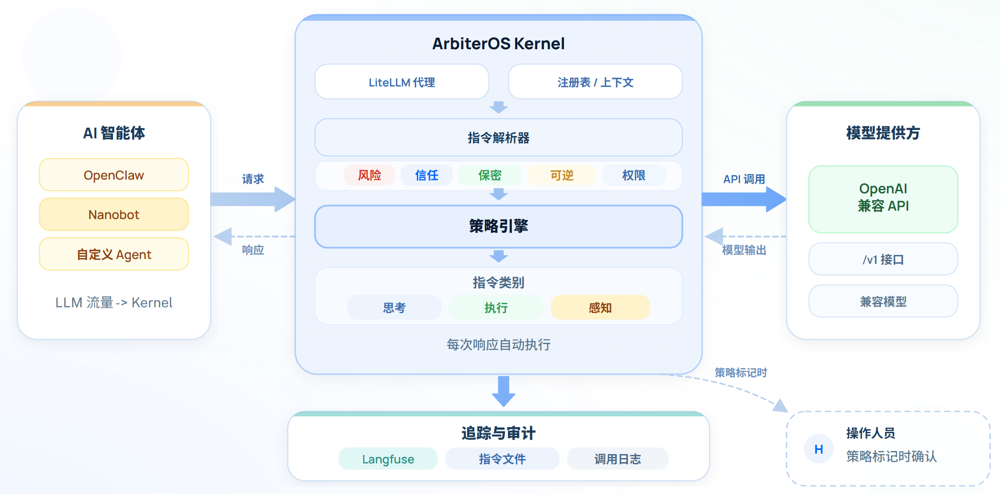

**语言:** [English](./README.md) | 简体中文

<div align="center">

# 🛡️ ArbiterOS

### ArbiterOS：面向 AI Agent 的治理内核

#### ArbiterOS 运行在 Agent 运行时的旁侧，在动作真正发生前执行策略约束、并拦截不安全动作。

[](https://github.com/cure-lab/ArbiterOS)
[](https://www.python.org/)
[](./LICENSE)
[](https://github.com/cure-lab/ArbiterOS)

[](https://arbiteros.ai/)
[](https://arbiteros.ai/demo/selected-cases/index.html?demoLang=en)
[](https://github.com/cure-lab/ArbiterOS)
[](https://arxiv.org/abs/2510.13857)

</div>

ArbiterOS 不是另一个 Agent Framework。它是一个面向 Agent 系统的运行时治理层，适用于能够将模型请求路由到 OpenAI 兼容端点的运行方式。

它优先解决三件事：

- **执行轨迹**：记录 Agent 规划了什么、调用了什么、返回了什么。
- **策略执行**：对解析后的指令、工具调用和带污点传播的数据流做策略检查。
- **动作拦截**：在敏感副作用真正发生前阻断风险操作。

## ArbiterOS 在 Agent 系统中的位置



## 为什么选择 ArbiterOS

- 对可自定义模型 URL 和 API Key 的 Agent 运行时，提供可插拔的治理边界。
- 基于指令流解析与污点感知数据流的策略检查能力。
- 支持 Linux、macOS、Windows 的本地私有化部署。
- 提供可审计的运行时日志，并可选接入 Langfuse 做可视化追踪。
- 对宿主改动小，只需将 Agent 运行时指向 ArbiterOS，即可在执行前施加约束。

## 支持的接入方式

ArbiterOS Kernel 当前最适合接入能够按请求或按配置覆盖模型端点的 Agent 运行时。

- 当前仓库内已覆盖或显式支持的方向：`OpenClaw`、`Nanobot`，以及 Kernel 代码中已映射的其他 parser 形态。
- 兼容的服务形态：OpenAI-compatible / LiteLLM-compatible routing。
- Kernel 启动后的默认本地端点：`http://127.0.0.1:4000/v1`

## 快速看到价值

最快的体验路径是：

1. 安装并启动 `ArbiterOS-Kernel`。
2. 在 `ArbiterOS-Kernel/litellm_config.yaml` 中配置一个上游模型。
3. 将 Agent 运行时指向 `http://127.0.0.1:4000/v1`。
4. 运行一个会调用工具的任务，查看生成的轨迹、策略决策和运行时日志。

## 基准结果

ArbiterOS 在多项 Agent 安全评测中展现出较强的拦截或告警提升：

- Native OpenClaw (GPT + Claude): **6.17% -> 92.95%**
- Agent-SafetyBench (Claude Sonnet 4): **0% -> 94.25%**
- AgentDojo (GPT-4o): **0% -> 93.94%**
- WildClawBench (GPT-5.2): **55% -> 100%**（告警导向指标）

## 根目录安装脚本用于快速完成 Kernel 引导：

- 检查必要命令（`curl`、`git`），必要时将 `uv` 安装到用户空间
- 确保 Python 版本为 `3.12+`
- 克隆或更新 `ArbiterOS`
- 使用 `uv sync --group dev` 安装 Kernel 依赖
- 在存在 `.env.example` 时生成 `ArbiterOS-Kernel/.env`
- 引导配置 `ArbiterOS-Kernel/litellm_config.yaml` 中的第一个模型项
- 为 `~/.openclaw/openclaw.json` 写入 `arbiteros` provider 配置
- 如果本机已安装 `openclaw`，则尝试重启 OpenClaw gateway 并打开 dashboard
- 生成可直接运行的脚本，如 `run-kernel.sh` / `run-kernel.ps1`

## 项目结构

- **`ArbiterOS-Kernel`**：核心治理内核，包含指令解析、污点传播、策略检查、回放资产和运行时 hook。
- **`assets/docs`**：技术文档，覆盖架构、策略接口、registry 行为、新 Agent 接入和可视化说明。
- **`langfuse`**：可选的可观测性与可视化栈，用于展示轨迹与治理流程。
- **`scripts`**：环境生成与本地初始化辅助脚本。
- **`assets/readme`**：README 图片及相关素材。

如果你第一次阅读这个仓库，建议先从 `ArbiterOS-Kernel` 理解产品核心，再到 `assets/docs` 阅读架构和扩展文档。

## 快速开始

### 安装

```bash
# Linux / macOS
git clone https://github.com/cure-lab/ArbiterOS.git
cd ArbiterOS
chmod +x install.sh
./install.sh
```

```powershell
# Windows (PowerShell)
git clone https://github.com/cure-lab/ArbiterOS.git
cd ArbiterOS
Set-ExecutionPolicy -Scope Process -ExecutionPolicy Bypass
.\install-windows.ps1
```

### 启动 Kernel

```bash
# Linux / macOS
./run-kernel.sh
```

```powershell
# Windows (PowerShell)
.\run-kernel.ps1
```

### 接入你的 Agent 运行时

Kernel 启动后，会自动：

1. 编辑 `ArbiterOS-Kernel/litellm_config.yaml`，填写上游模型、API Key 和 base URL。
2. 将 Agent 运行时或 provider profile 指向 `http://127.0.0.1:4000/v1`。
3. 运行一个会调用工具的任务，并在运行时日志或 Langfuse 中查看治理结果。

## 可选：Langfuse UI

```bash
cd ArbiterOS/langfuse
cp .env.prob.example .env
docker compose -f docker-compose.yml up -d --build
```

## 文档

- Kernel 架构：`assets/docs/kernel.md`
- 策略接口：`assets/docs/kernel-policy_interface.md`
- Registry 与污点标签：`assets/docs/registry_usage.md`
- 新 Agent 接入：`assets/docs/add_new_agent.md`
- 可视化说明：`assets/docs/visualization.md`
- 文档索引：`assets/docs/README.md`

## 可选：用户级 systemd 服务

如果你希望后台自动重启并简化日常运维，可以使用用户级服务：

- service name: `arbiteros-kernel`
- service file: `~/.config/systemd/user/arbiteros-kernel.service`
- working directory: `ArbiterOS/ArbiterOS-Kernel`
- start command: `uv run poe litellm`

常用命令：

```bash
systemctl --user status arbiteros-kernel
journalctl --user -u arbiteros-kernel -f
systemctl --user restart arbiteros-kernel
```

## 路线图

### 近期方向

- 更清晰的 benchmark 指标定义与更易复现的结果打包
- Linux、macOS、Windows 环境下的进一步加固
- 面向常见高风险操作的更多策略包
- 面向操作者的轨迹与策略检查体验优化

### 研究方向

- 长期记忆保护能力增强
- 基于聚类数据流信号的 prompt injection 检测
- 自进化策略机制
- 多模态模型支持
- 优化记忆与资源管理，以支撑智能体长期运行
