# Langfuse Tracing

This document describes the Langfuse-based tracing and governance UI used with ArbiterOS.

---

# Home Page

The Home Page displays overview metrics. The following are most relevant to ArbiterOS:

## Governed Signals

- **Definition**: errorCount + warningCount + policyViolationCount
- **Meaning**: Total count of all signals that require governance attention, under the current filters and time range

## Errors

- **Definition**: Sum of counts where level = ERROR
- **Latest bucket**: Error count in the most recent time bucket (not the latest single event)

## Warnings

- **Definition**: Sum of counts where level = WARNING
- **Latest bucket**: Warning count in the most recent time bucket

## Policy Violations

- **Definition**: Sum of counts where level = POLICY_VIOLATION
- **Latest bucket**: Policy Violation count in the most recent time bucket

## Governance Assets

- **Experience packs**: summary.experiences.length — number of accumulated experience items
- **prompt lines**: summary.promptPack.lines.length — number of governance statements that can be directly inserted into prompts

## Governance Trend

Two modes are available:

1. **Error & Warning**
   - Two lines: Errors and Warnings
   - Shows overall risk and alert fluctuation
2. **Policy Violation**
   - One line: Policy Violations
   - Shows policy block/violation event fluctuation

Each point on the chart represents the count for the corresponding time bucket.

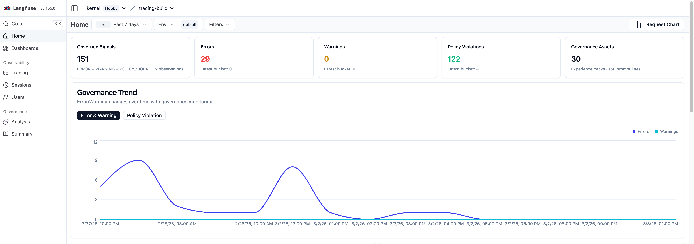

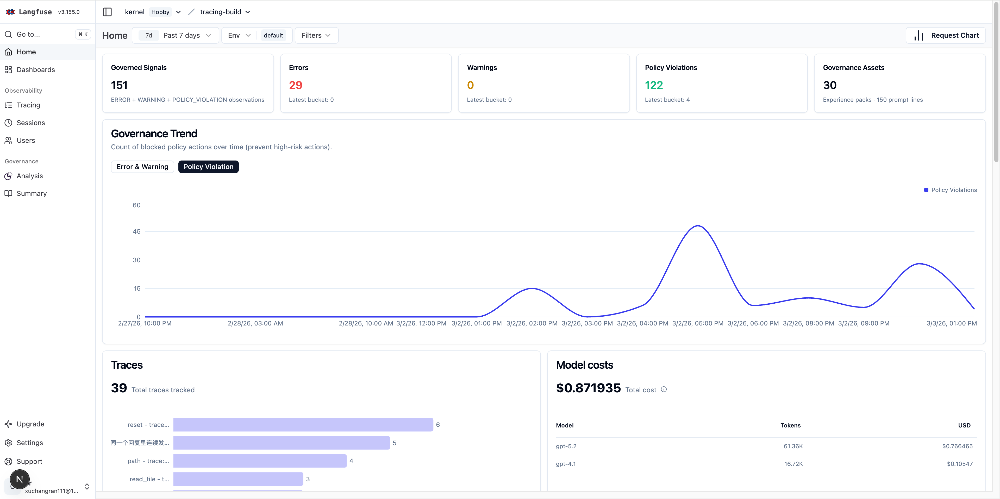

---

# Tracing

The Tracing page lists all traces. Traces are split by `/reset` or `/new`.

## Topic

The Topic column shows the subject of each trace, helping you understand and locate specific traces.

## Observation Levels

The Observation Levels column summarizes each trace:

- ⚔️: # of Policy Violation Node
- 🚨: # of Error Node
- ℹ️: # of Node

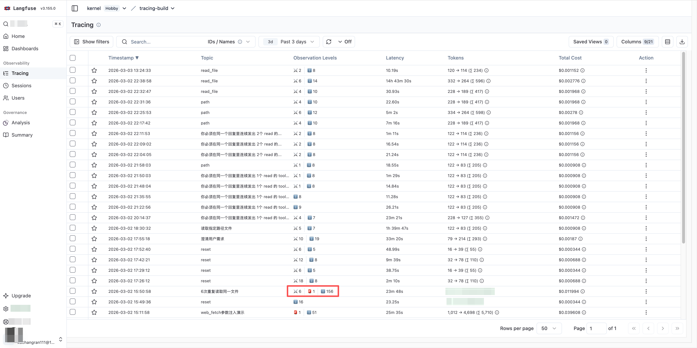

## Trace Banner (top governance bar)

A governance summary Banner (Trace Banner) appears at the top of the Tracing page for an overview of risks.

### Common fields

- **Enhanced Governance Mode: Active**
  - Indicates enhanced governance mode is enabled
- **Governance Summary**
  - errors: number of error nodes
  - warnings: number of warning nodes
  - policy violations: number of policy violation nodes
  - across X nodes: total nodes covered by the stats

### Type groups (clickable)

- **Error node types**
  - Shows error categories as type(count)
  - Click to expand the node list for that type and **quickly locate** issues
- **Policy violation node types**
  - Shows policy violation categories as type(count)
  - Click to see the corresponding nodes and **quickly locate** issues

### Usage tips

- Check Governance Summary first to assess risk scale
- Click Error node types / Policy violation node types to find high-frequency types
- Open the Analysis panel for specific nodes to see root causes and fix suggestions

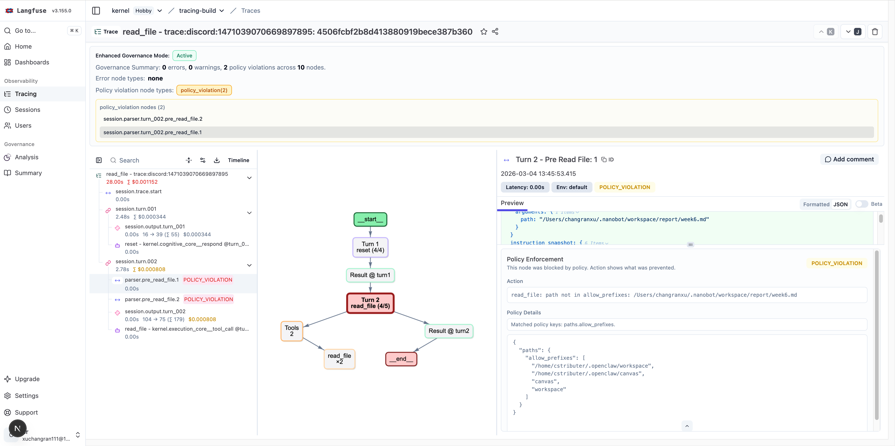

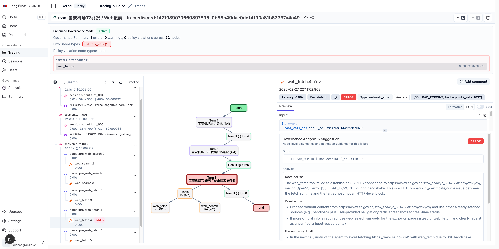

## Graph

The Graph area is controlled mainly via the top-right toolbar and mouse interaction.

### Basic view controls

- **Zoom in**: Click the + button
- **Zoom out**: Click the - button
- **Reset view**: Click the reset button (fit entire graph)
- **Open fullscreen graph**: Enter fullscreen graph mode
- **Pan**: Click and drag on empty space
- **Scroll zoom**: Mouse wheel or trackpad gesture to zoom

### Graph mode switch

- Use the branch icon to switch between two modes:
  - **Execution Flow Graph**: Emphasizes execution flow and path relationships
  - **Hierarchy Graph**: Emphasizes hierarchy and structure; cleaner and clearer (default)

**Hierarchy Graph (default)**

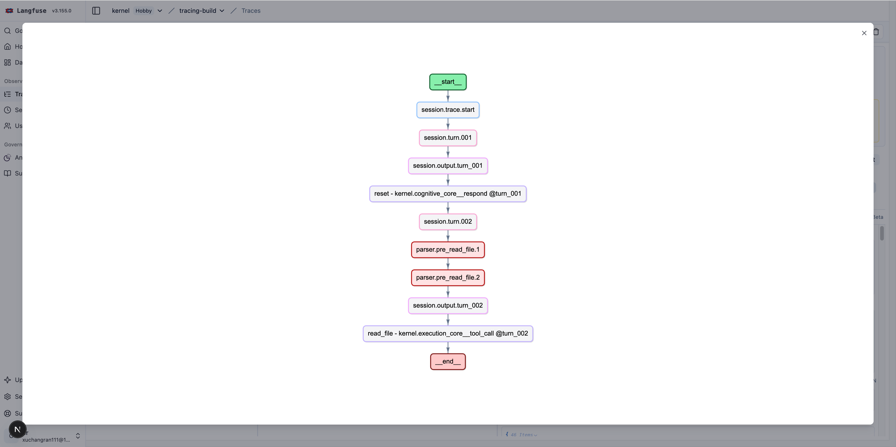

**Execution Flow Graph**

### Node search and navigation

- Click the magnifier to open the search box (Search nodes)
- Enter keywords to match nodes (by name, type, level, etc.)
- In the search box:
  - Enter: jump to next match
  - Shift + Enter: jump to previous match
  - Or use the left/right arrow buttons to cycle through matches

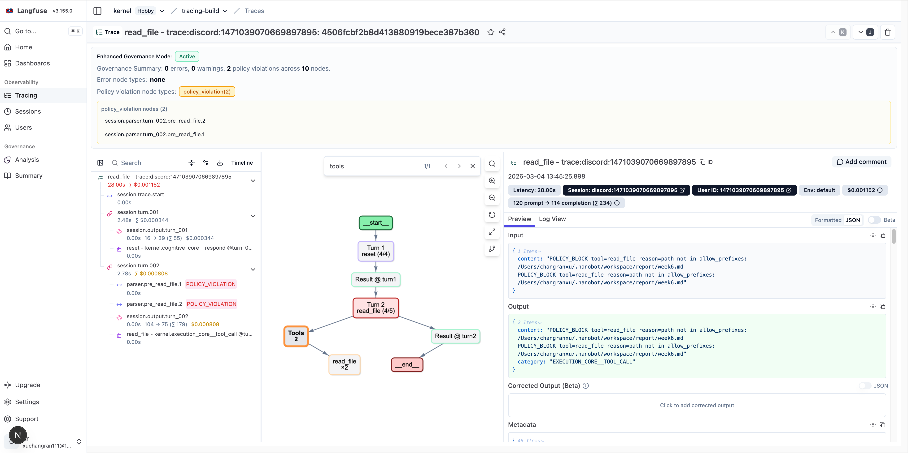

### Node selection and cycling

- Click a node to locate its observation
- If a graph node maps to multiple observations, click repeatedly to cycle through them

### Error Node / Policy Violation Node

- Error nodes and Policy Violation nodes are highlighted in red in the graph for quick identification.

## Analysis panel (bottom-right, for Error / Policy Violation nodes)

When you select an **ERROR, WARNING, or POLICY_VIOLATION node**, the governance analysis panel appears in the detail area (usually in the lower or bottom-right section).

### A. ERROR / WARNING nodes

Common panel content:

- **Output**: Node output/state (for quick identification of failure behavior)
- **Analysis**
- **Root cause**: Explanation of why it failed
- **Resolve now**: Immediate fix suggestions (short-term)
- **Prevention next call**: Suggestions to prevent recurrence (long-term stability)

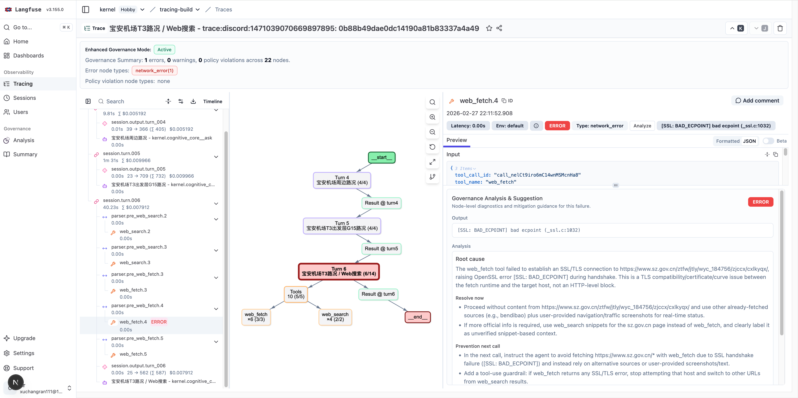

You can also click the Analyze button (top-right) to generate manually if Error Analysis Auto Generation is off, or to regenerate.

### B. POLICY_VIOLATION nodes

The panel focuses on policy execution explanation:

- **Action**: The blocked action and reason (e.g., a tool request rejected by policy)
- **Policy Details**: Matched policy keys, related policy snippets, or descriptions
- Long content can be expanded/collapsed for easier reading

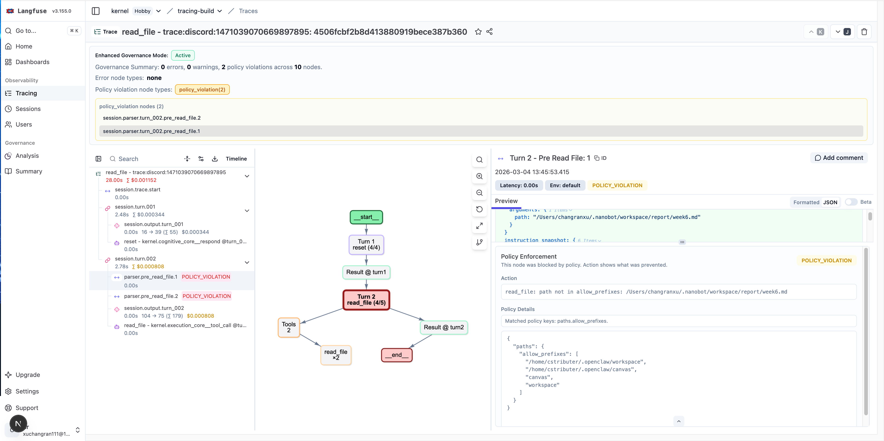

---

# Analysis

### Top switch buttons

The Analysis page has two main view modes:

- **Error & Warning**
  - Shows only ERROR and WARNING level nodes

  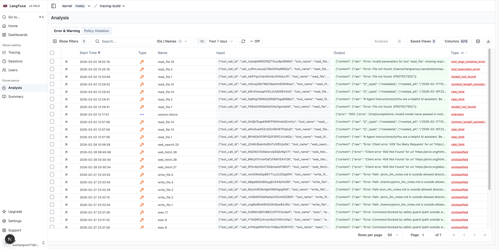

  - Supports filtering by **Error Type**

  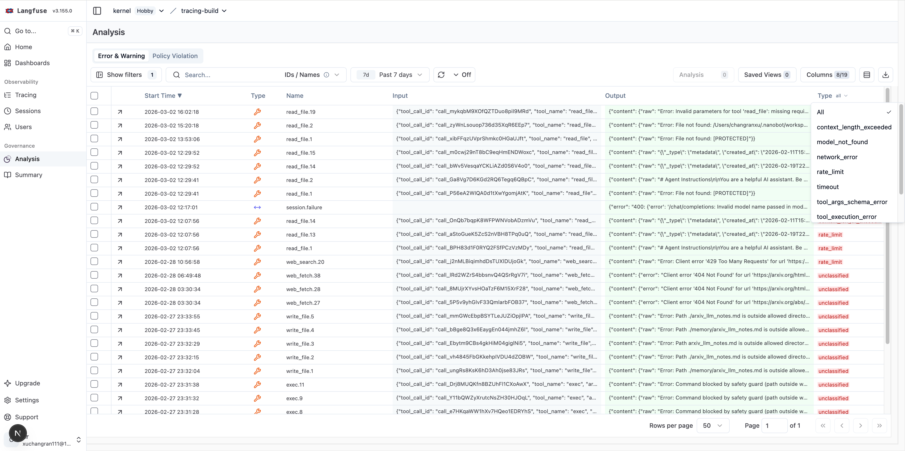

  - Supports batch **Analysis** on selected error nodes

  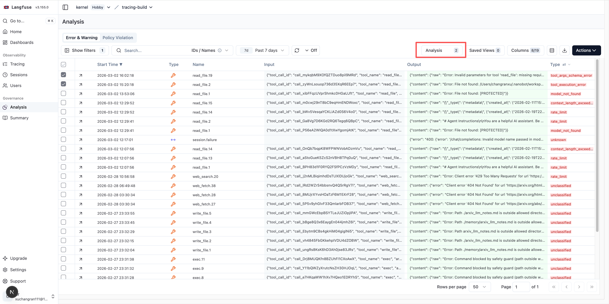

- **Policy Violation**
  - Shows only POLICY_VIOLATION nodes

  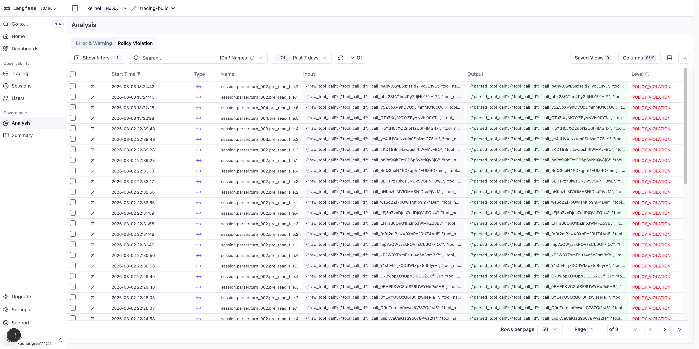

  - Focused on policy violation investigation

### Click a node to navigate to its Trace

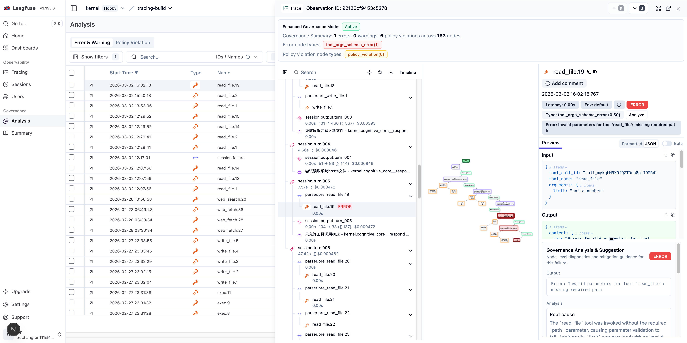

---

# Summary

## Top toolbar buttons

- **Model selection (e.g. gpt-5.2)**
  - Choose the model used to generate/update the Summary.

- **Generate (full)**
  - Full Summary generation. Use for first-time generation or full rebuild.

- **Update (incremental)**
  - Incremental Summary update. Processes only new/pending content; faster.
  - The button is disabled when the system detects the Summary is already up to date.

- **Insert markdown path**
  - Insert the current Summary into a Markdown file (typically the system prompt) so the LLM can avoid repeating the same errors and know how to fix them.

- **Settings**
  - Open settings (analysis, Markdown file path, etc.).

- **Copy all**
  - Copy the full summary text for use in prompts (including Prompt Pack and experience lines).

- **Download JSON**
  - Download the current Summary as JSON for backup or external processing.

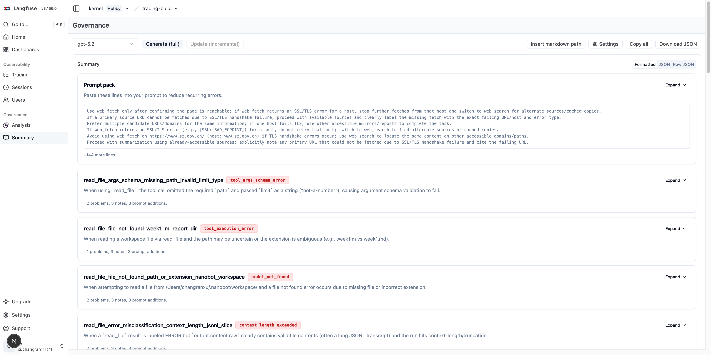

## Editing

### Edit Prompt Pack

Click any text in the entry to enter edit mode. You can edit:

- **Title**: Prompt Pack title
- **Lines (one per line)**: One prompt constraint/statement per line

### Edit Experience

Click any text in the entry to enter edit mode. Each Experience can be expanded/collapsed and has these fields:

- **Key (snake_case)**: Unique identifier for the experience (use stable naming)
- **When**: Scenario description where this experience applies
- **Keywords** (comma-separated): Search keywords
- **Related error types** (comma-separated): Associated error types
- **Possible problems**: Potential issues
- **Avoidance and notes**: Avoidance tips and notes
- **Prompt additions**: Specific statements to append to the prompt

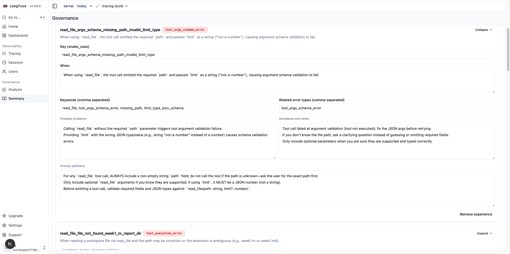

**In edit mode you can add or remove Experiences**

- **Add**: Click **Add experience**
  - A blank experience is added; fill in the fields above.
- **Remove**: Click **Remove experience** inside an Experience
  - The experience is removed from the current draft (saved after you save).

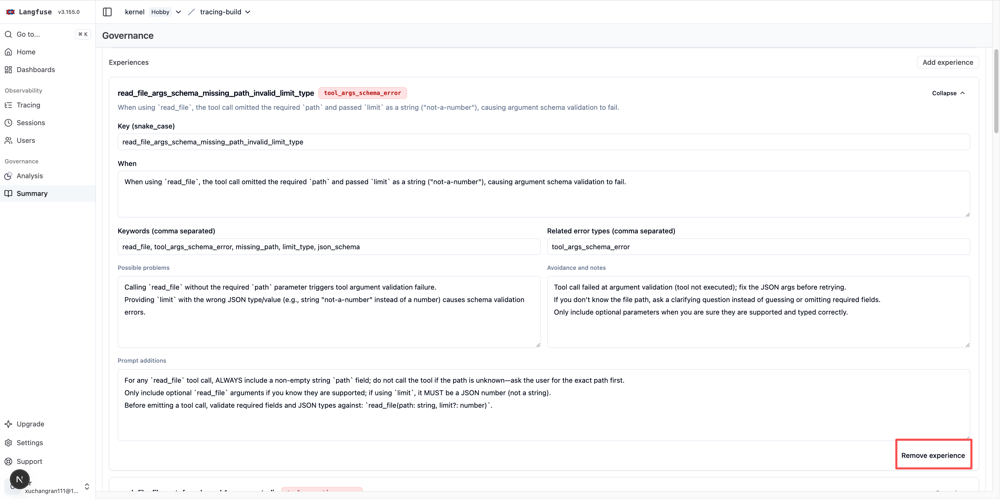

### Save and exit edit mode

- **Save**: Save current changes
- **Discard**: Discard changes and revert to last saved state

- If you have unsaved changes and switch views, leave the page, or click elsewhere, a prompt asks you to:
  - Save and continue
  - Discard and continue
  - Cancel

---

# Setting

## LLM Connections

Error Analysis and Summary generation depend on the API configuration in LLM Connections.

## Error Analysis

### 1) Automatic Error Analysis

- **Auto-generate error analysis** toggle:
  - When on, the system automatically analyzes new errors/warnings as they arrive
  - When off, no automatic analysis (you can trigger manually)

### 2) Model

- Available only when automatic analysis is on
  - Specifies the model used for automatic analysis
  - Choose a stable, cost-effective model for your team

### 3) New error nodes before auto summary update

- Meaning: How many new error nodes must accumulate before triggering an automatic Summary update
- **Leave empty**: Use system default (1)
- Rules:
  - Must be a positive integer
  - Minimum value is 1

### 4) Markdown summary output mode

- Controls what is written to the Markdown file:
  - **Prompt pack only (recommended)**: Output only the Prompt Pack
  - **Prompt pack + experiences**: Output both Prompt Pack and Experiences
- Note: This affects only the Markdown file content, not the full structured Summary data in the database

### 5) Append summary prevention note to markdown path (optional)

- Specify an absolute path to a Markdown file for writing/updating the summary
- The Markdown file is typically the Agent system prompt file. As experience accumulates, the Agent output becomes more reliable and avoids repeating the same errors.
- Requirements:
  - Must be an **absolute path**
  - Filename must end with `.md`
- Behavior:
  - File is created if it does not exist
  - Each Summary update replaces the corresponding HINT block with the latest content

### 6) Save button behavior

Save is enabled when:

- The current user has project settings permission
- There are unsaved changes on the page
- All input validation passes (threshold, path format, etc.)

A success message appears when saved; an error message appears on failure.

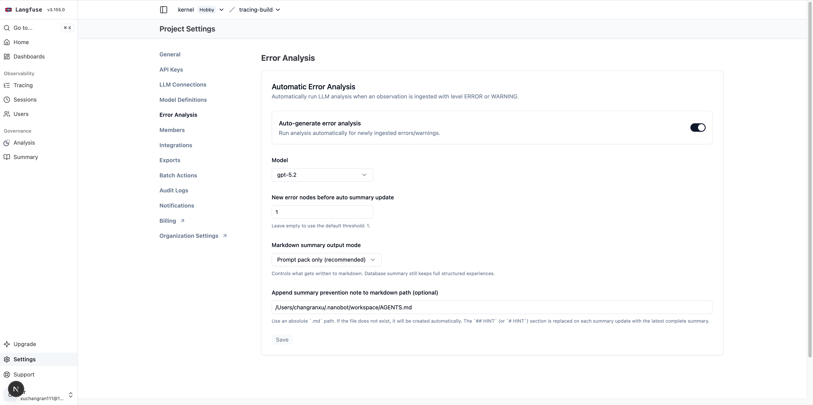
