# Langfuse Tracing

This document describes the Langfuse-based tracing and governance UI used with ArbiterOS.

## Table of Contents

- [Install and Run](#install-and-run)
  - [Development Mode](#development-mode)
  - [Production Mode](#production-mode)
- [Page Guide](#page-guide)
  - [Home Page](#home-page)
  - [Tracing](#tracing)
  - [Analysis](#analysis)
  - [Summary](#summary)
  - [Policy](#policy)
  - [Settings](#settings)

---

## Install and Run

Run all commands from the repository root.

### Prerequisites

- Node.js 24
- pnpm 9.5.0
- Docker with Docker Compose

### Development Mode

Development mode runs the web app and worker locally, while PostgreSQL, ClickHouse, Redis, and MinIO run via `docker-compose.dev.yml`.

1. Create the local environment file:

   ```bash
   cp .env.dev.example .env
   ```

2. Install dependencies:

   ```bash
   pnpm i
   ```

3. Start the local infrastructure:

   ```bash
   pnpm run infra:dev:up
   ```

4. On the first run, initialize the databases and seed example data:

   ```bash
   pnpm --filter=shared run db:reset -f
   pnpm --filter=shared run ch:reset
   pnpm --filter=shared run db:seed:examples
   ```

5. Start the development servers:

   ```bash
   pnpm run dev
   ```

Open `http://localhost:3000` after the app is ready.

If you ran `db:seed:examples`, you can sign in with:

- Email: `demo@langfuse.com`
- Password: `password`

For later restarts, when the database is already initialized, you usually only need:

```bash
pnpm run infra:dev:up
pnpm run dev
```

If you want a full clean-room reset, `pnpm run dx` reinstalls dependencies, recreates local infrastructure, resets both databases, seeds example data, and starts development mode.

### Production Mode

Production mode uses `docker-compose.yml` to build and run the full stack in containers.

1. Create the production environment file:

   ```bash
   cp .env.prod.example .env
   ```

2. Edit `.env` before the first start and replace the placeholder secrets, especially `NEXTAUTH_SECRET`, `SALT`, `ENCRYPTION_KEY`, and any database, Redis, or MinIO passwords you do not want to keep at their defaults.

3. Build and start the production stack for the first time:

   ```bash
   docker compose -f docker-compose.yml up -d --build
   ```

4. Open `http://localhost:3000`.

Production startup applies migrations automatically, so the first boot can take a little longer than later restarts. It does not seed the example dataset used in development mode. Create the first user in the UI, or set `LANGFUSE_INIT_USER_EMAIL`, `LANGFUSE_INIT_USER_NAME`, and `LANGFUSE_INIT_USER_PASSWORD` in `.env` if you want the container startup to provision one for you.

Useful follow-up commands:

- Start previously built images without rebuilding:

  ```bash
  docker compose -f docker-compose.yml up -d
  ```

- Stop the stack without removing containers:

  ```bash
  docker compose -f docker-compose.yml stop
  ```

- Restart previously stopped containers:

  ```bash
  docker compose -f docker-compose.yml start
  ```

  `docker compose start` only works after the containers were already created by
  `docker compose up` or `docker compose create`. If you previously ran
  `docker compose down`, use `docker compose -f docker-compose.yml up -d`
  instead.

- Rebuild containers after local code changes:

  ```bash
  docker compose -f docker-compose.yml up -d --build
  ```

- Stop and remove the stack containers while keeping the named volumes:

  ```bash
  docker compose -f docker-compose.yml down
  ```

The production compose stack starts `langfuse-web`, `langfuse-worker`, PostgreSQL, ClickHouse, Redis, and MinIO. On startup, `web/entrypoint.sh` applies the Postgres and ClickHouse migrations automatically before the web container begins serving traffic.

---

## Page Guide

The sections below walk through each major page in the Langfuse governance UI.

### Home Page

The Home Page displays overview metrics. The following are most relevant to ArbiterOS:

#### Key Metrics

| Metric | Definition | Notes |
| --- | --- | --- |
| Governed Signals | `errorCount + warningCount + policyViolationCount` | Total count of all signals that require governance attention under the current filters and time range |
| Errors | Sum of counts where `level = ERROR` | "Latest bucket" means the error count in the most recent time bucket, not the latest single event |
| Warnings | Sum of counts where `level = WARNING` | "Latest bucket" means the warning count in the most recent time bucket |
| Policy Violations | Sum of counts where `level = POLICY_VIOLATION` | "Latest bucket" means the policy violation count in the most recent time bucket |

#### Governance Assets

- **Experience packs**: `summary.experiences.length` — number of accumulated experience items
- **Prompt lines**: `summary.promptPack.lines.length` — number of governance statements that can be directly inserted into prompts

#### Governance Trend

Two modes are available:

1. **Error & Warning**
   - Two lines: Errors and Warnings
   - Shows overall risk and alert fluctuation
2. **Policy Violation**
   - One line: Policy Violations
   - Shows policy block/violation event fluctuation

Each point on the chart represents the count for the corresponding time bucket.


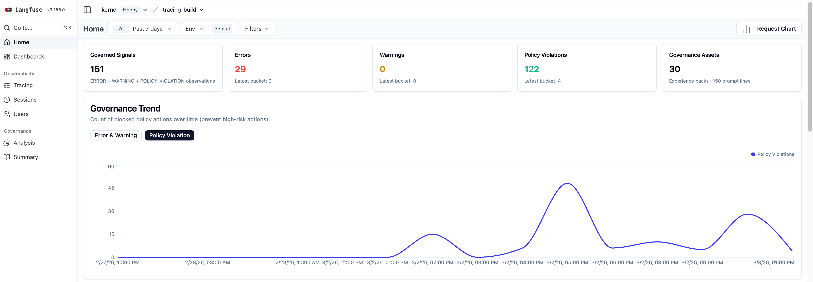

#### Policy Violations Card

The Home page includes a **Policy violations** table card for policy-focused triage.

- **Main fields**:
  - **Policy name**
  - **Description**
  - **Triggered** (count)
- **Unclassified row**:
  - Includes policy violation nodes where no policy name is extracted
- **Common usage**:
  - Quickly identify high-frequency violated policies from the `Triggered` column

##### Link Navigation

- **Card title link** (`Policy violations`, top-left of the card):
  - Jumps to Analysis page with policy-violation mode
- **Triggered count link** (per row):
  - Jumps to Analysis page filtered by the specific policy type
- **Result**:
  - Directly lands in the policy investigation view, reducing manual filtering steps

#### Policy Confirmation Stats Card

The Home page also includes a **Policy confirmation stats** card for reviewing
how users respond to policy confirmation prompts.

- **Main fields**:
  - **Policy**
  - **Total**
  - **Accepted** (rate and count)
  - **Rejected** (rate and count)
- **Sorting and highlight**:
  - Rows are sorted by rejected ratio in descending order
  - Rows at or above the configured reject-rate threshold are highlighted
  - You can adjust this threshold in Settings via
    **Policy reject-rate highlight threshold (%)**
- **Policy refinement suggestion**:
  - Highlighted rows are clickable and open a **Policy refinement suggestion**
    dialog for that policy
  - The dialog uses rejected-turn evidence from the current filters and time
    range to generate an LLM-assisted refinement suggestion
  - The generated result includes a suggested policy update, the reason behind
    it, and supporting signals from the observed traces
  - Use **Regenerate with latest context** to rerun the suggestion with the
    latest filtered evidence

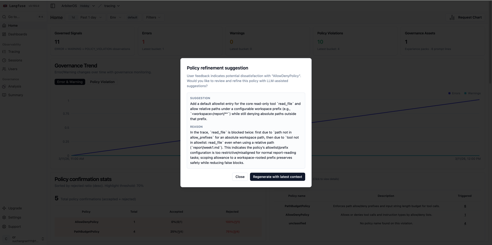

- **Clickable counts**:
  - Clicking the accepted/rejected count opens a detail panel for that policy
    and confirmation state
  - The detail panel lists matching turns and shows the corresponding full trace

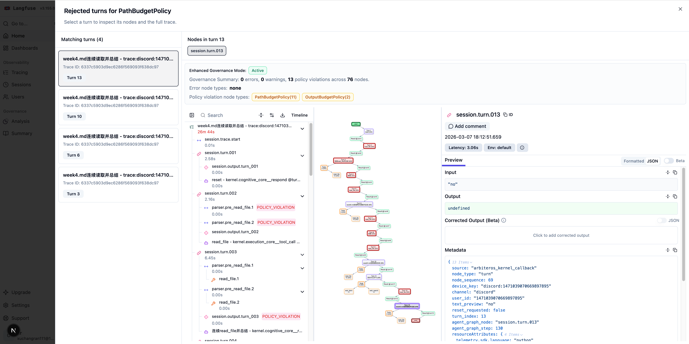

- **Turn-level inspection**:
  - The node list is scoped to the matching `session.turn.xxx` node
  - The matching turn node is selected by default so the trace detail view opens
    directly on that node
- **Common usage**:
  - Quickly identify policies with high reject rates
  - Drill from aggregate policy stats into the exact turn where the user
    accepted or rejected the policy confirmation

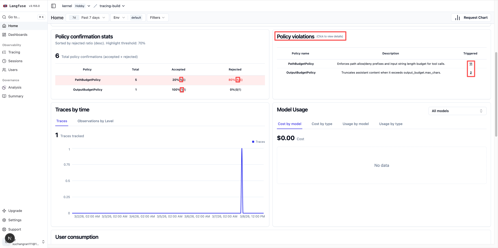

---

### Tracing

The Tracing page lists all traces. Traces are split by `/reset` or `/new`.

#### Topic

The Topic column shows the subject of each trace, helping you understand and locate specific traces.

#### Observation Levels

The Observation Levels column summarizes each trace:

| Icon | Meaning |
| --- | --- |
| ⚔️ | Number of policy violation nodes |
| 🚨 | Number of error nodes |
| ⚠️ | Number of warning nodes |
| ℹ️ | Number of nodes |

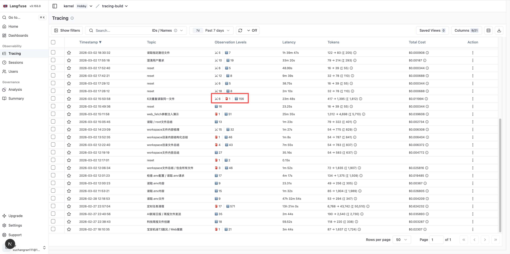

#### Trace Banner

A governance summary Banner (Trace Banner) appears at the top of the Tracing page for an overview of risks.

##### Common Fields

- **Enhanced Governance Mode: Active**
  - Indicates enhanced governance mode is enabled
- **Governance Summary**
  - errors: number of error nodes
  - warnings: number of warning nodes
  - policy violations: number of policy violation nodes
  - across X nodes: total nodes covered by the stats

##### Type Groups

- **Error node types**
  - Shows error categories as type(count)
  - Click to expand the node list for that type and **quickly locate** issues
- **Policy violation node types**
  - Shows policy violation categories as type(count)
  - Click to see the corresponding nodes and **quickly locate** issues

##### Usage Tips

- Check Governance Summary first to assess risk scale
- Click Error node types / Policy violation node types to find high-frequency types
- Open the Analysis panel for specific nodes to see root causes and fix suggestions

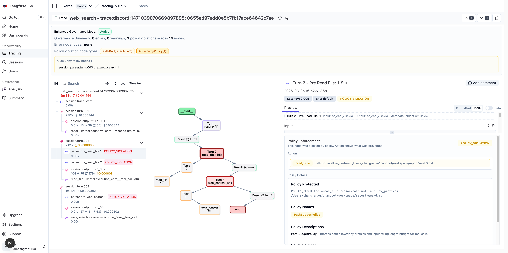


#### Graph

The Graph area is controlled mainly via the top-right toolbar and mouse interaction.

##### Basic View Controls

- **Zoom in**: Click the + button
- **Zoom out**: Click the - button
- **Reset view**: Click the reset button (fit entire graph)
- **Open fullscreen graph**: Enter fullscreen graph mode
- **Pan**: Click and drag on empty space
- **Scroll zoom**: Mouse wheel or trackpad gesture to zoom

##### Graph Mode Switch

- Use the branch icon to switch between two modes:
  - **Execution Flow Graph**: Emphasizes execution flow and path relationships
  - **Hierarchy Graph**: Emphasizes hierarchy and structure; cleaner and clearer (default)

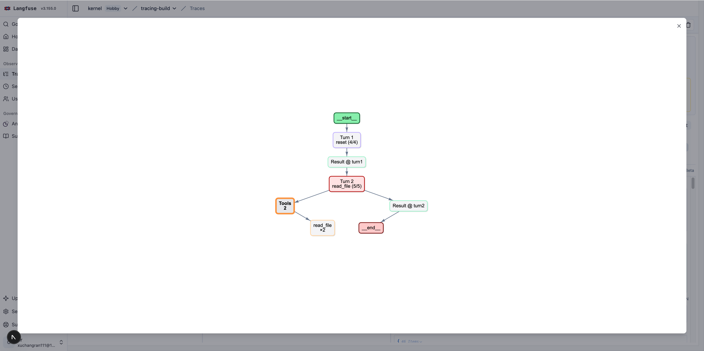

**Hierarchy Graph (default)**


**Execution Flow Graph**

##### Node Search and Navigation

- Click the magnifier to open the search box (Search nodes)
- Enter keywords to match nodes (by name, type, level, etc.)
- In the search box:
  - Enter: jump to next match
  - Shift + Enter: jump to previous match
  - Or use the left/right arrow buttons to cycle through matches

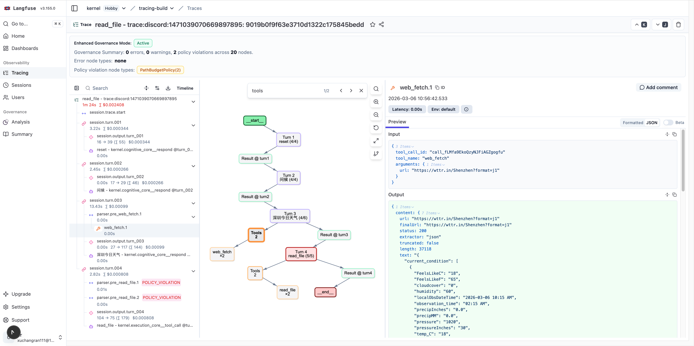

##### Node Selection and Cycling

- Click a node to locate its observation
- If a graph node maps to multiple observations, click repeatedly to cycle through them

##### Error and Policy Violation Nodes

- Error nodes and Policy Violation nodes are highlighted in red in the graph for quick identification.

#### Analysis Panel

When you select an **ERROR, WARNING, or POLICY_VIOLATION node**, the governance analysis panel appears in the detail area (usually in the lower or bottom-right section).

##### Error / Warning Nodes

Common panel content:

- **Output**: Node output/state (for quick identification of failure behavior)
- **Analysis**
- **Root cause**: Explanation of why it failed
- **Resolve now**: Immediate fix suggestions (short-term)
- **Prevention next call**: Suggestions to prevent recurrence (long-term stability)


You can also click the Analyze button (top-right) to generate manually if Error Analysis Auto Generation is off, or to regenerate.

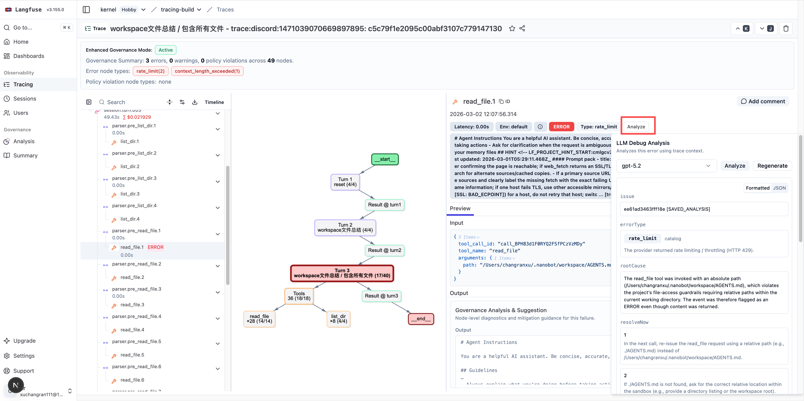

##### Policy Violation Nodes

The panel focuses on policy enforcement details for blocked requests:

- **Action**: The blocked action and reason (e.g., a tool call rejected by policy)
- **Policy Protected**: A concise rule hit summary for the current block
- **Policy Names / Policy Descriptions**: Matched policy names and their intent
- **Policy Sources**: Source policy snippet/path used for the decision
- Long content can be expanded/collapsed for easier reading

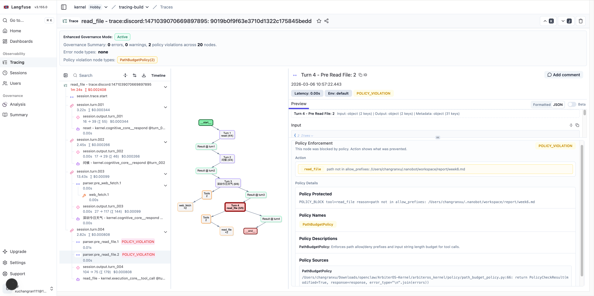

---

### Analysis

#### View Modes

The Analysis page has two main view modes:

- **Error & Warning**
  - Shows only ERROR and WARNING level nodes

  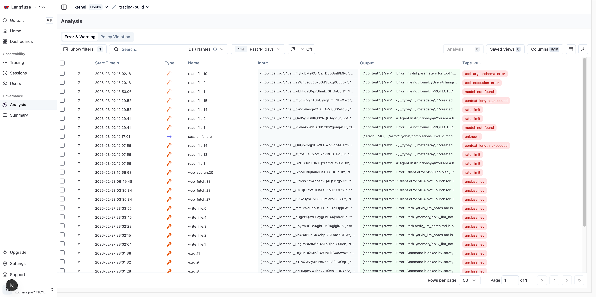
  - Supports filtering by **Error Type**

  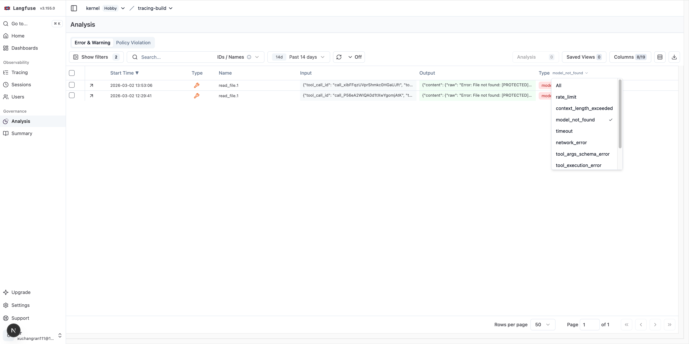
  - Supports batch **Analysis** on selected error nodes

  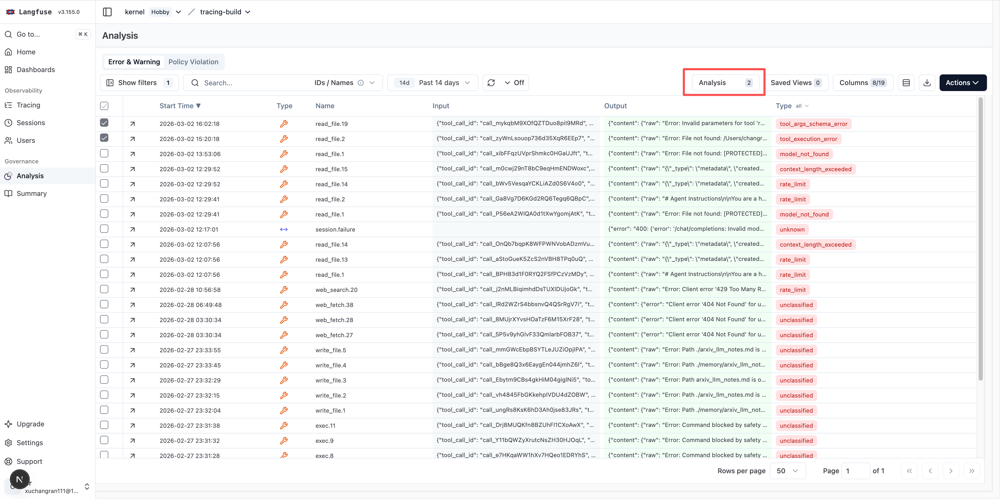

- **Policy Violation**
  - Shows only POLICY_VIOLATION nodes

  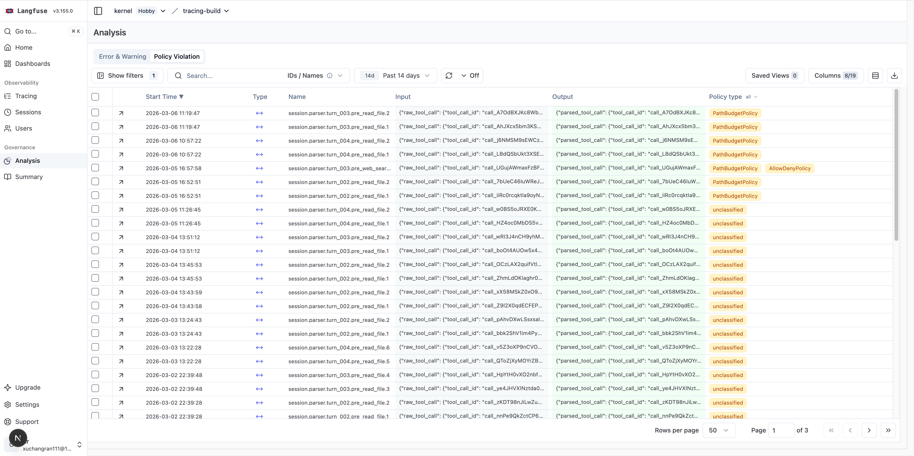
  - Focused on policy violation investigation
  - Supports filtering by **Policy type**

  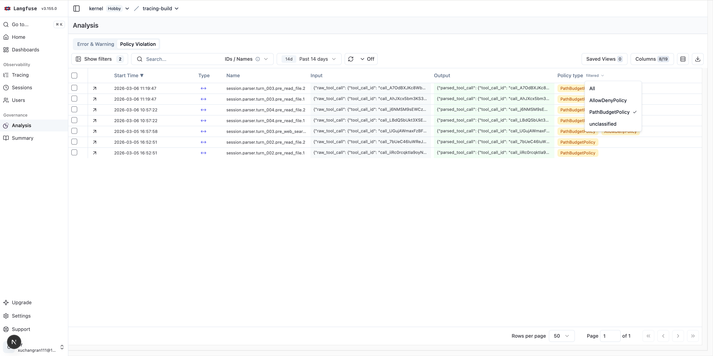

#### Open a Trace from Analysis

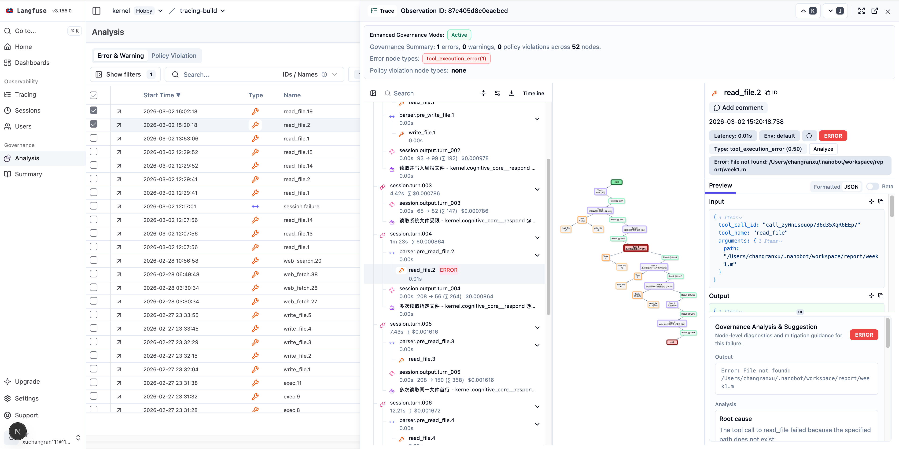

---

### Summary

#### Top Toolbar

- **Model selection (e.g. gpt-5.2)**
  - Choose the model used to generate/update the Summary.

- **Generate (full)**
  - Full Summary generation. Use for first-time generation or full rebuild.

- **Update (incremental)**
  - Incremental Summary update. Processes only new/pending content; faster.
  - The button is disabled when the system detects the Summary is already up to date.

- **Insert markdown path**
  - Insert the current Summary into a Markdown file (typically the system prompt) so the LLM can avoid repeating the same errors and know how to fix them.

- **Settings**
  - Open settings (analysis, Markdown file path,
    **Policy reject-rate highlight threshold (%)**, etc.).

- **Copy all**
  - Copy the full summary text for use in prompts (including Prompt Pack and experience lines).

- **Download JSON**
  - Download the current Summary as JSON for backup or external processing.


#### Editing

##### Edit Prompt Pack

Click any text in the entry to enter edit mode. You can edit:

- **Title**: Prompt Pack title
- **Lines (one per line)**: One prompt constraint/statement per line

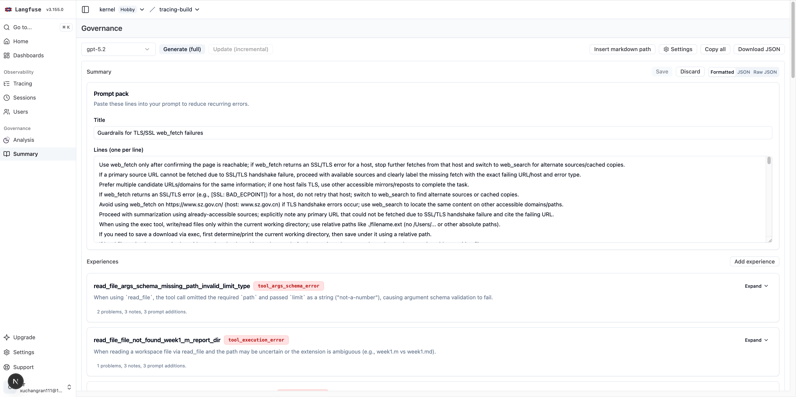

##### Edit Experience

Click any text in the entry to enter edit mode. Each Experience can be expanded/collapsed and has these fields:

- **Key (snake_case)**: Unique identifier for the experience (use stable naming)
- **When**: Scenario description where this experience applies
- **Keywords** (comma-separated): Search keywords
- **Related error types** (comma-separated): Associated error types
- **Possible problems**: Potential issues
- **Avoidance and notes**: Avoidance tips and notes
- **Prompt additions**: Specific statements to append to the prompt


**In edit mode you can add or remove Experiences**

- **Add**: Click **Add experience**
  - A blank experience is added; fill in the fields above.
- **Remove**: Click **Remove experience** inside an Experience
  - The experience is removed from the current draft (saved after you save).

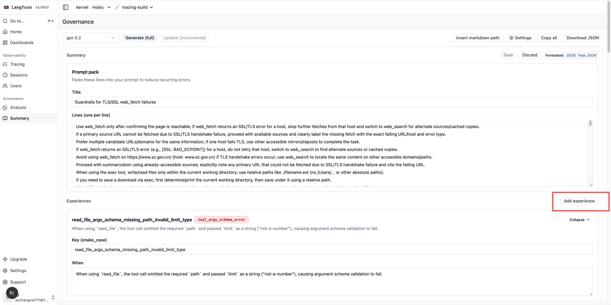


##### Save or Discard Changes

- **Save**: Save current changes
- **Discard**: Discard changes and revert to last saved state

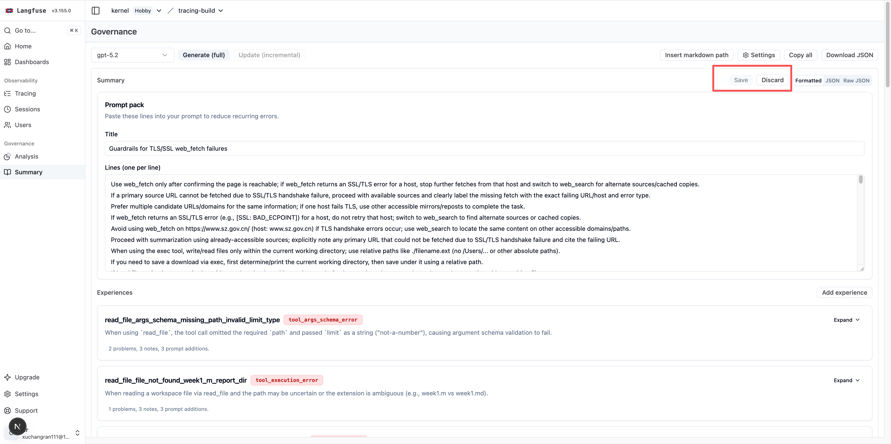

- If you have unsaved changes and switch views, leave the page, or click elsewhere, a prompt asks you to:
  - Save and continue
  - Discard and continue
  - Cancel

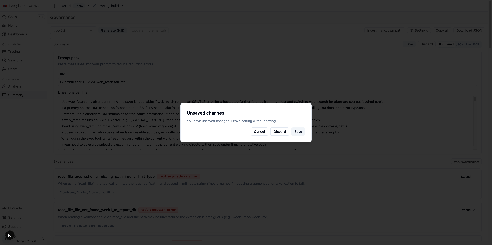

---

### Policy

The Policy page is the main Langfuse workspace for reading, reviewing, and editing ArbiterOS kernel policies. It loads `policy.json` and `policy_registry.json` from the configured kernel path, then renders one card per `policy_registry.json` entry with the matching runtime sections from `policy.json`.

#### Policy Source and Live Context

At the top of the page, **Policy source and live context** shows where Langfuse is reading policy files from and what surrounding context is active for policy guidance.

- **Path**:
  - Accepts the `arbiteros_kernel` folder path, or a direct path to `policy.json` / `policy_registry.json`
  - The path must be absolute
  - For custom Docker mount layouts, use `LANGFUSE_PATH_PREFIX_MAP` so host paths can be rewritten to container paths
- **Save Path**:
  - Stores the kernel policy path in project settings
  - When a saved path exists, the page auto-loads policy files on page open
- **Load Policy Files**:
  - Reads the current files from disk into the page
- **Save Policy Files**:
  - Writes the current in-page draft back to `policy.json` and `policy_registry.json`
- **LLM connection / Error Analysis model**:
  - Shows the OpenAI-compatible connection and configured model that are used for beginner summaries and LLM-assisted policy updates
- **Last policy update**:
  - Shows the last time Langfuse saved policy files from this page
- **Kernel source updated**:
  - Shows the latest file update time detected from disk
- **Resolved input / policy.json / policy_registry.json**:
  - Shows the exact resolved file paths Langfuse is reading

The page also watches the kernel source continuously:

- It checks the source files every 5 seconds
- If the source changes on disk and you do not have unsaved edits, the page refreshes automatically
- If you do have unsaved edits, Langfuse shows a warning first so the reload does not silently overwrite your draft

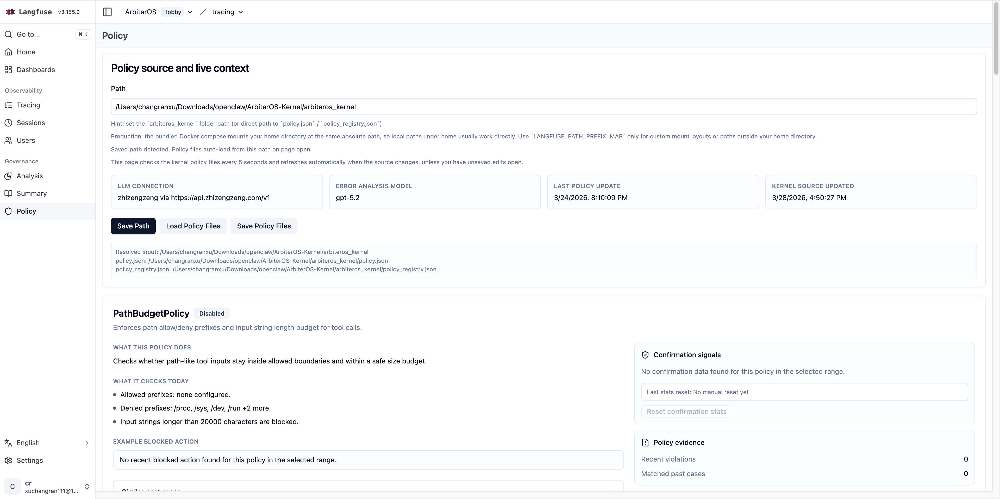

#### Policy Card

Each policy card combines policy configuration with recent governance evidence.

- **What this policy does**:
  - Short description of the policy intent
- **What it checks today**:
  - Human-readable summary of the mapped runtime settings currently active for this policy
  - For example, `PathBudgetPolicy` summarizes the `paths` and `input_budget` sections
- **Example blocked action**:
  - Recent blocked action or prompt snippet, when recent evidence exists
- **Similar past cases**:
  - Matched rejected-confirmation cases for this policy
  - Click **Open trace** to open the matching observation in the trace peek and quickly locate the original trace and turn

`Generate beginner summary` is useful when you want to understand a policy quickly. Langfuse sends the current policy settings together with recent policy evidence to the LLM and generates a plain-language explanation for non-technical readers.

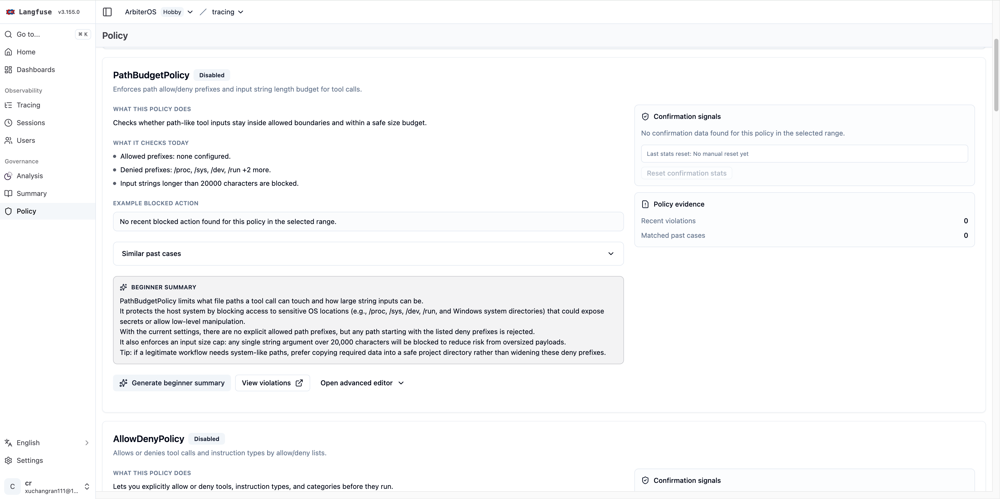

#### Confirmation Signals and Evidence

The right side of the card focuses on policy-specific evidence:

- **Confirmation signals**:
  - Shows total confirmations, accepted count, and rejected count for that policy
- **Rejected-rate highlight**:
  - The page uses the same reject-rate threshold configured in Settings for the Home page highlight
  - If the rejected rate is at or above the threshold, the rejected value is highlighted and the policy card is visually emphasized
- **Reset confirmation stats**:
  - Records a reset timestamp for this policy, so the confirmation stats can start fresh from that point
- **Policy evidence**:
  - Shows recent violation count and matched past case count

`View violations` opens the **Analysis** page with `analysisLevel=policy_violation` and the current `policyType` already applied, so you land directly in the filtered policy-investigation view.

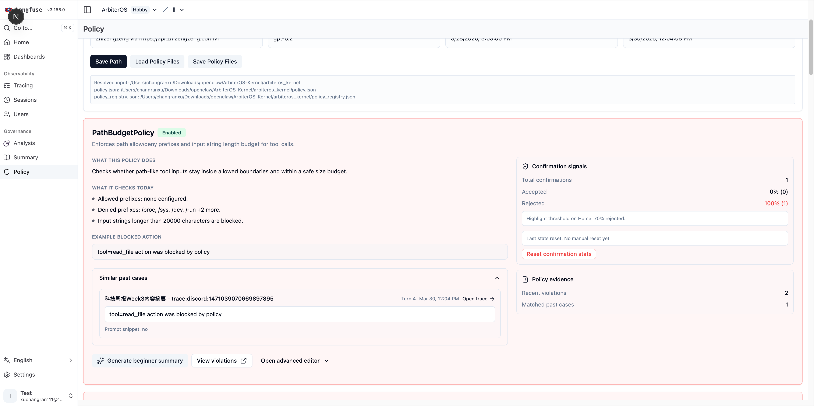

When you drill into a matched case, Langfuse opens the observation/trace peek so you can inspect the original trace without leaving the policy workflow.

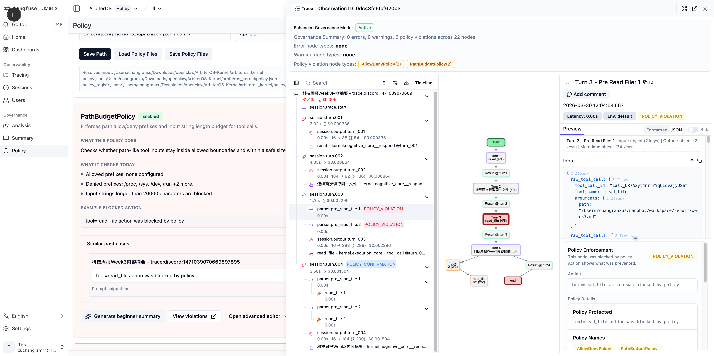

#### Advanced Editor and LLM-Assisted Update

If the current policy is not satisfactory, open **Advanced editor**.

- You can toggle whether the policy is enabled in `policy_registry.json`
- You can edit the registry description
- You can edit the mapped JSON sections from `policy.json` directly
- Invalid JSON blocks both saving and LLM proposal generation

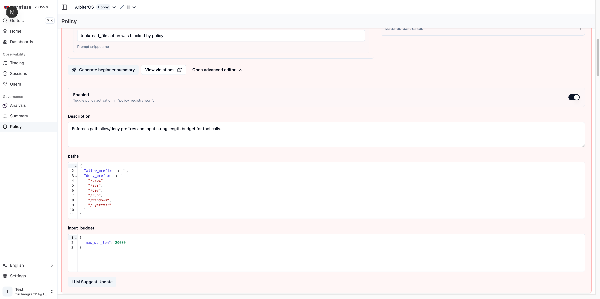

`LLM Suggest Update` is an assisted workflow, not an immediate write:

1. Langfuse first generates a policy suggestion from rejected confirmations and policy-violation evidence.
2. It then generates a proposed `policy.json` update for the current policy only.
3. The dialog shows a diff for the mapped editable sections of that policy.
4. If you click **Apply to Draft**, the proposal is copied into the in-page draft.
5. You still need to click **Save Policy Files** to write the final change back to disk.

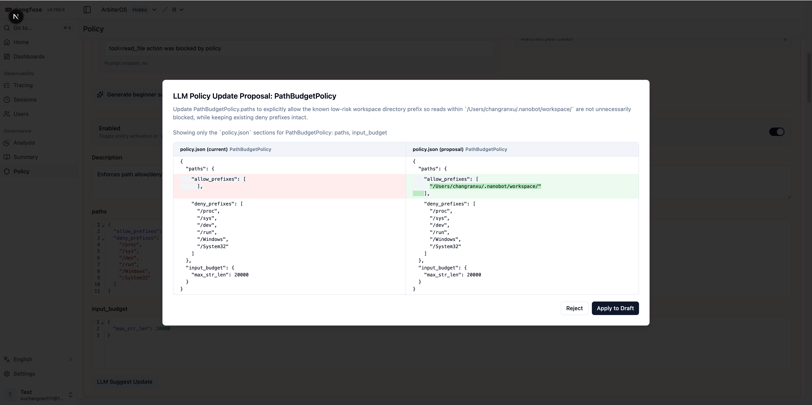

---

### Settings

#### LLM Connections

Error Analysis and Summary generation depend on the API configuration in LLM Connections.

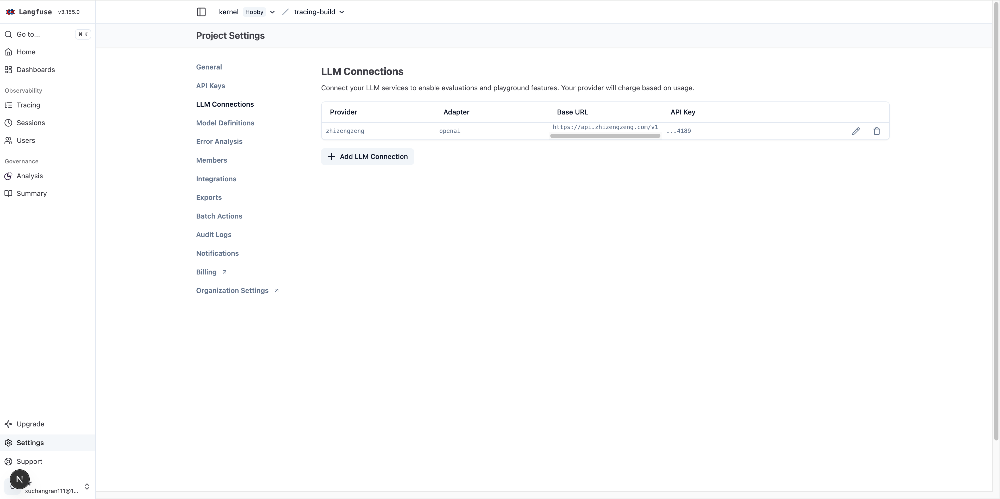

#### Error Analysis

##### Automatic Error Analysis

- **Auto-generate error analysis** toggle:
  - When on, the system automatically analyzes new errors/warnings as they arrive
  - When off, no automatic analysis (you can trigger manually)

##### Model

- Available only when automatic analysis is on
  - Specifies the model used for automatic analysis
  - Choose a stable, cost-effective model for your team

##### New Error Nodes Before Auto Summary Update

- Meaning: How many new error nodes must accumulate before triggering an automatic Summary update
- **Leave empty**: Use system default (1)
- Rules:
  - Must be a positive integer
  - Minimum value is 1

##### Policy Reject-Rate Highlight Threshold (%)

- Controls when rows in the Home page **Policy confirmation stats** card are highlighted
- If a policy's reject rate is at or above this threshold, that row is highlighted on Home
- **Leave empty**: Use system default (70)
- Common usage:
  - Lower it to surface more policies for review
  - Raise it to highlight only the most rejection-heavy policies

##### Markdown Summary Output Mode

- Controls what is written to the Markdown file:
  - **Prompt pack only (recommended)**: Output only the Prompt Pack
  - **Prompt pack + experiences**: Output both Prompt Pack and Experiences
- Note: This affects only the Markdown file content, not the full structured Summary data in the database

##### Markdown Summary Path (Optional)

- Specify an absolute path to a Markdown file for writing/updating the summary
- The Markdown file is typically the Agent system prompt file. As experience accumulates, the Agent output becomes more reliable and avoids repeating the same errors.
- Requirements:
  - Must be an **absolute path**
  - Filename must end with `.md`
- Behavior:
  - File is created if it does not exist
  - Each Summary update replaces the corresponding HINT block with the latest content

##### Save Button Behavior

Save is enabled when:

- The current user has project settings permission
- There are unsaved changes on the page
- All input validation passes (threshold, path format, etc.)

A success message appears when saved; an error message appears on failure.

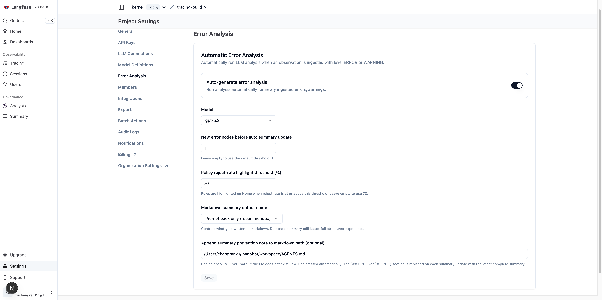
